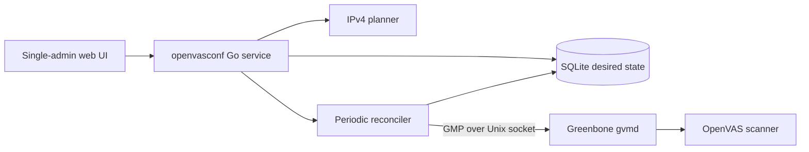

# openvasconf

[](https://github.com/arumes31/openvasconf/actions/workflows/ci.yml)
[](https://github.com/arumes31/openvasconf/actions/workflows/security.yml)
[](https://github.com/arumes31/openvasconf/actions/workflows/supply-chain.yml)
[](https://github.com/arumes31/openvasconf/actions/workflows/container.yml)

`openvasconf` is a small, single-admin control plane that turns customer IPv4
scope into recurring Greenbone/OpenVAS targets and scan tasks. It normalizes and
classifies addresses, packs multiple networks into targets of no more than 4,095
unique IPs, assigns each customer a weekly scan slot, and continuously reconciles
the desired configuration through GMP.

> [!IMPORTANT]
> This project and Greenbone's Community Container stack are intended for testing
> and familiarization. Greenbone explicitly does not recommend that container
> setup for production. Check the workflow badges before using a revision and
> only scan networks for which you have explicit authorization.

## Table of contents

- [What it creates](#what-it-creates)
- [Planning rules](#planning-rules)
- [Architecture](#architecture)
- [Requirements](#requirements)
- [Quick start with Greenbone](#quick-start-with-greenbone)
- [First-run configuration](#first-run-configuration)
- [Usage guide](#usage-guide)
- [Reconciliation and deletion](#reconciliation-and-deletion)
- [Configuration reference](#configuration-reference)
- [Operations](#operations)
- [Security](#security)
- [Backup, restore, and upgrades](#backup-restore-and-upgrades)
- [Troubleshooting](#troubleshooting)
- [Development](#development)
- [GitHub automation and releases](#github-automation-and-releases)
- [Current scope and limitations](#current-scope-and-limitations)

## What it creates

For every active customer, `openvasconf` manages:

- one persistent weekly schedule named `Customer_Weekly_Schedule`;
- one or more private targets named `Customer_PrivateIP_TargetN`;
- matching private tasks named `Customer_PrivateIP_TaskN`;
- one or more public targets named `Customer_WAN_TargetN`;
- matching public tasks named `Customer_WAN_TaskN`;
- local ownership mappings, desired-state hashes, audit events, and reconciliation
  history in SQLite.

The scanner, scan configuration, and port list are global defaults with optional
per-customer overrides. The initial automatic selections are:

| Setting | Initial exact-name selection |
|---|---|
| Scanner | `OpenVAS Default` |
| Scan configuration | `Full and fast` |
| Port list | `All IANA assigned TCP` |

Automatic selection succeeds only after the Greenbone feeds have imported those
objects. All selections can be changed in **Greenbone settings**.

## Planning rules

The preview and reconciler use the same deterministic network plan:

1. Only IPv4 is accepted.
2. A bare address is stored as `/32`; for example, `192.168.10.0` means
   `192.168.10.0/32`, not `/24`.
3. Prefixes broader than `/24` are split into `/24` entries.
4. Duplicate and overlapping coverage is scanned once.
5. RFC1918 space is grouped as `PrivateIP`; public global-unicast space is
   grouped as `WAN`.
6. Private and WAN entries are never mixed in the same target.
7. A target can contain multiple prefixes, but never more than 4,095 unique IPs.
8. Special-use ranges such as loopback, link-local, CGNAT, documentation,
   multicast, and reserved space are rejected.

Single hosts remain canonical `/32` values in SQLite. They are sent to current
`gvmd` versions as bare IPv4 addresses because GMP target host specifications
reject the `/32` suffix.

### Example

Creating `testcomp1` with:

```text
10.1.0.0/16
192.168.10.0
7.7.7.7/32
```

produces 18 private target/task pairs and one WAN pair. The `/16` expands to 256
`/24` entries, the bare `192.168.10.0` becomes one private `/32`, and the public
address becomes one WAN `/32`.

Every task for the customer uses the same weekly schedule. New customers receive
a cryptographically random minute and weekday from the global policy, which
defaults to Monday through Thursday, 07:00–15:00 in `Europe/Vienna`.

## Architecture



The app is a statically compiled Go service. HTML, CSS, and JavaScript are
embedded in the binary. The container runs as UID/GID `1001`, drops all Linux
capabilities, uses a read-only root filesystem, and writes only to `/data` and a
small `/tmp` tmpfs. GMP credentials are used over the shared `gvmd` Unix socket;
the application does not expose Greenbone's database.

## Requirements

For the complete local test stack:

- a Linux host supported by the
  [Greenbone Community Container guide](https://greenbone.github.io/docs/latest/22.4/container/index.html),
  or a compatible Docker environment;
- Docker Engine and Docker Compose v2;
- network routing from the `ospd-openvas` scanner container to every customer
  subnet that will be scanned;
- explicit permission to scan each supplied address range.

Greenbone's published sizing is:

| Resource | Minimum | Recommended |
|---|---:|---:|
| CPU | 2 cores | 4 cores |
| RAM | 4 GB | 8 GB |
| Free storage | 20 GB | 60 GB |

The Greenbone services use the images published at
`registry.community.greenbone.net/community`. Running `docker compose pull`
retrieves the current image behind each upstream tag.

## Quick start with Greenbone

The complete test deployment is defined in one tracked file:
[`deploy/greenbone-compose.yaml`](deploy/greenbone-compose.yaml). It uses
Greenbone's published Community Container images directly and includes the
published `openvasconf` image in the same Compose project. No overlay is used.

### 1. Clone and prepare directories

```bash
git clone https://github.com/arumes31/openvasconf.git
cd openvasconf
mkdir -p secrets
chmod 700 secrets
```

PowerShell:

```powershell
git clone https://github.com/arumes31/openvasconf.git
Set-Location openvasconf
New-Item -ItemType Directory -Force secrets | Out-Null
```

### 2. Create secrets

Create two single-line files with different strong passwords of at least 12
characters:

| File | Used for |
|---|---|
| `secrets/admin_password` | Local `openvasconf` user `admin` |
| `secrets/gmp_password` | Greenbone/GMP user, `admin` by default |

Linux/macOS example:

```bash
printf '%s' 'replace-with-a-strong-local-password' > secrets/admin_password
printf '%s' 'replace-with-a-different-gmp-password' > secrets/gmp_password
chmod 600 secrets/*
```

PowerShell example:

```powershell
Set-Content -NoNewline secrets/admin_password '<strong-local-password>'
Set-Content -NoNewline secrets/gmp_password '<different-strong-gmp-password>'
```

Do not commit either file. The app password bootstraps the local account only
when the database is new; changing the file later does not rotate an existing
account.

### 3. Start the complete stack and set the Greenbone admin password

Pull first so image-download failures are separate from service startup:

```bash
docker compose -f deploy/greenbone-compose.yaml pull
docker compose -f deploy/greenbone-compose.yaml up -d
GMP_PASSWORD="$(cat secrets/gmp_password)"
docker compose -f deploy/greenbone-compose.yaml exec -u gvmd gvmd \
  gvmd --user=admin --new-password="$GMP_PASSWORD"
unset GMP_PASSWORD
```

PowerShell:

```powershell
docker compose -f deploy/greenbone-compose.yaml pull
docker compose -f deploy/greenbone-compose.yaml up -d
$GMPPassword = Get-Content -Raw secrets/gmp_password
docker compose -f deploy/greenbone-compose.yaml exec -u gvmd gvmd `
  gvmd --user=admin --new-password=$GMPPassword
Remove-Variable GMPPassword
```

Greenbone creates an insecure `admin`/`admin` account initially. The password
change must exactly match `secrets/gmp_password` or GMP authentication will fail.
Passwords containing shell metacharacters must be passed with appropriate shell
quoting.

This starts Greenbone and `openvasconf` together. For a repeatable app version,
set `OPENVASCONF_IMAGE` to the verified digest from the `image-digest` workflow
artifact before running `pull` and `up`:

```bash
export OPENVASCONF_IMAGE='ghcr.io/arumes31/openvasconf@sha256:REPLACE_WITH_DIGEST'
```

PowerShell:

```powershell
$env:OPENVASCONF_IMAGE = `
  'ghcr.io/arumes31/openvasconf@sha256:REPLACE_WITH_DIGEST'
```

The default `edge` tag is intended only for testing. If the package is private,
authenticate first with `docker login ghcr.io`.

### 4. Wait for Greenbone feeds

Initial feed import can take a substantial amount of time. Follow the logs:

```bash
docker compose -f deploy/greenbone-compose.yaml logs -f
```

Stop following logs with `Ctrl+C`; the containers keep running. Greenbone is
ready for full configuration when GSA shows the scanner, scan configurations,
port lists, and feed data. See Greenbone's
  [feed synchronization guide](https://greenbone.github.io/docs/latest/22.4/container/workflows.html#performing-a-feed-synchronization)
if objects remain unavailable.

Open:

- `openvasconf`: <http://127.0.0.1:8080>
- Greenbone Security Assistant: <https://127.0.0.1> or
  <https://127.0.0.1:9392> with the current official file

The Greenbone test certificate is self-signed. Both interfaces bind to loopback
by default and are not reachable from another machine.

### 5. Verify service health

```bash
curl --fail http://127.0.0.1:8080/health/live
curl --fail http://127.0.0.1:8080/health/ready
```

- `/health/live` returns HTTP 200 when the web process is alive.
- `/health/ready` returns HTTP 200 only when SQLite and Greenbone respond; it
  returns HTTP 503 while GMP is unavailable.

## First-run configuration

1. Log in with username `admin` and the contents of
   `secrets/admin_password`.
2. Open **Greenbone** and select **Test Greenbone connection**.
3. Review the global scanner, scan configuration, and port list. If they are
   blank, wait for feed import and try again.
4. Set the IANA timezone used for new customers.
5. Choose the allowed weekdays and time window. The allowed outer limits are
   Monday–Thursday and 07:00–15:00.
6. Save the global defaults.

Changing the global schedule policy does not silently move existing customer
slots. Existing schedules remain stable and are marked as outside policy when
appropriate; use **Randomize schedule** or edit the customer to move one.

## Usage guide

### Add a customer

1. Select **Add customer**.
2. Enter a unique name of 1–100 characters. The Greenbone-safe form is limited
   to 64 ASCII letters, digits, hyphens, and underscores.
3. Optionally add a description of up to 500 characters and up to 10 normalized
   tags of 30 characters each.
4. Enter one IPv4 address or CIDR per line. Comma-separated input is also
   accepted. A `.txt` or `.csv` file can populate the field in the browser.
5. Keep the randomized weekly slot or choose a specific Monday–Thursday time
   between 07:00 and 15:00.
6. Keep the global scanner/config/port-list values or select customer overrides.
7. Select **Review generated changes**, inspect normalization, overlap warnings,
   target utilization, and the before/after summary.
8. Confirm to save the desired state and queue reconciliation.

The browser review token is signed, expires after 15 minutes, and includes the
customer revision so a stale edit cannot overwrite a newer browser edit.

### Understand customer state

| State | Meaning |
|---|---|
| `pending` | Desired state changed and has not been fully applied. |
| `syncing` | A reconciliation run is active. |
| `applied` | Every desired object is checkpointed successfully. |
| `error` | The last run stopped; open technical detail or history. |

The dashboard shows desired revision, progress, retry state, next scan date,
effective policy objects, and the latest successful reconciliation. Use **Check
remote drift** to compare local mappings with remote existence and ownership.

### Synchronize and retry

- **Synchronize all** queues every customer, including deleted rows awaiting
  cleanup.
- A row's **Sync** or **Retry** action queues one customer.
- **Synchronize selected** operates on checked rows in the current filtered view.
- The background reconciler also runs at startup and every minute by default.

Transient network and GMP 5xx failures receive up to three attempts with short
exponential backoff. Non-transient rejections stop immediately and remain
visible as `error`.

### Start an unscheduled scan

Open an applied customer and select **Start scan** beside a managed task. Before
starting it, `openvasconf` verifies that the task exists and still contains this
installation's ownership marker. The recurring weekly schedule remains intact.

### Clone a customer

**Clone customer** creates a new customer with copied metadata, networks,
schedule, and policy overrides. The name is suffixed with `Copy` and made unique;
new Greenbone objects are created under the clone's own ownership markers.

### Import and export

**Portability** downloads a versioned JSON document containing global settings
and all active customers. Import is validate-and-preview-before-apply with these
limits:

- 1 MiB upload;
- 500 customers per document;
- 2,000 network definitions per customer;
- JSON version `1` only;
- unknown JSON fields are rejected.

Existing customers match by ID, or by case-insensitive name when the imported ID
is empty. Omitted customers are never deleted. Import is not a restore of deleted
local rows and does not include credentials, sessions, history, ownership
mappings, or Greenbone reports.

## Reconciliation and deletion

Reconciliation is idempotent: unchanged applied resources cause no Greenbone
writes. For new or changed desired state, it creates or modifies the schedule,
targets, and tasks and stores a checkpoint after each successful operation. If a
remote object was created but the local checkpoint was interrupted, the next run
can recover it by its unique ownership marker.

Every managed object's Greenbone comment contains an installation/customer
ownership marker. Before modifying or deleting a mapped object, the reconciler
reads the remote comment. A missing or different marker stops the operation
instead of touching an object it cannot prove it owns.

Greenbone cannot safely mutate every referenced target/task field in place. When
networks, port lists, scan configurations, scanners, or schedules require a task
replacement, the old owned task is moved to Greenbone trash and a deterministic
replacement is created.

### Removing networks

After the edit review is confirmed, surplus owned tasks are moved to trash first,
then surplus targets. The customer's one weekly schedule remains while the
customer remains active.

### Removing a customer

The local row is soft-deleted immediately and disappears from the normal web UI.
The next reconciliation moves owned tasks, targets, and schedule to Greenbone
trash in dependency order. GMP deletion uses `ultimate=0`; `openvasconf` never
permanently purges Greenbone objects.

> [!NOTE]
> Greenbone trash preserves the remote objects, but this version has no web action
> to restore a soft-deleted local customer. Recovery must be handled from a
> database backup and coordinated with the Greenbone trash state. Do not describe
> the delete button as a complete one-click undo.

## Configuration reference

Duration values use Go syntax such as `30s`, `1m`, or `12h`.

| Environment variable | Default | Purpose |
|---|---|---|
| `OPENVASCONF_LISTEN` | `127.0.0.1:8080` | HTTP listen address. Compose sets `0.0.0.0:8080` inside the container but publishes it on host loopback. |
| `OPENVASCONF_DATABASE` | `data/openvasconf.db` | SQLite database path. |
| `OPENVASCONF_GMP_SOCKET` | `/run/gvmd/gvmd.sock` | `gvmd` Unix socket. |
| `OPENVASCONF_GMP_USERNAME` | `admin` | GMP username. |
| `OPENVASCONF_GMP_PASSWORD_FILE` | none | Preferred file containing the GMP password. |
| `OPENVASCONF_GMP_PASSWORD` | empty | Direct GMP password fallback for development. |
| `OPENVASCONF_ADMIN_PASSWORD_FILE` | none | Preferred local bootstrap-password file. |
| `OPENVASCONF_ADMIN_PASSWORD` | empty | Direct local bootstrap-password fallback for development. |
| `OPENVASCONF_TIMEZONE` | `Europe/Vienna` | Initial schedule timezone for a new database. |
| `OPENVASCONF_RECONCILE_INTERVAL` | `1m` | Full drift-reconciliation interval. |
| `OPENVASCONF_EXTERNAL_TIMEOUT` | `15s` | Deadline for each GMP call. |
| `OPENVASCONF_SESSION_LIFETIME` | `12h` | Local admin session lifetime. |
| `OPENVASCONF_SECURE_COOKIES` | `false` | Always mark session and CSRF cookies `Secure`. |
| `OPENVASCONF_TRUST_PROXY_TLS` | `false` | Trust `X-Forwarded-Proto: https` when deciding whether cookies are secure. |
| `OPENVASCONF_PORT` | `8080` | Compose-only host port substitution; it is not read by the Go process. |

File-based secrets take precedence over direct values. The admin password must
contain at least 12 characters. All configured durations must be positive, and
the timezone must be a valid IANA name.

The single deployment file exposes the commonly changed username, timezone,
port, and secure-cookie settings. Set additional supported variables through a
local `.env` file or the shell when needed; keep passwords in the files under
`secrets/` rather than in Compose or environment files.

## Operations

### Logs and status

```bash
docker compose -f deploy/greenbone-compose.yaml ps
docker compose -f deploy/greenbone-compose.yaml logs --tail=200 openvasconf
docker compose -f deploy/greenbone-compose.yaml logs --tail=200 gvmd
```

Application logs are structured JSON on stdout. The web UI adds live GMP
latency, feed version/age, active task state, latest report severity, per-resource
drift, and reconciliation history.

Authenticated JSON endpoints used by the web UI are:

| Endpoint | Purpose |
|---|---|
| `GET /api/status` | SQLite/GMP availability and GMP version |
| `GET /api/options` | Available scanners, scan configs, and port lists |
| `GET /api/operations` | Feed and task activity |
| `POST /api/preview` | Network-plan preview |
| `GET /api/customers/{id}/progress` | Reconciliation progress |
| `GET /api/customers/{id}/drift` | Remote ownership/existence check |

These endpoints require the browser session; mutating POST requests also require
the CSRF token. They are not a separately versioned public API.

### Query GMP directly

```bash
docker compose -f deploy/greenbone-compose.yaml run --rm gvm-tools \
  gvm-cli socket --xml '<get_version/>'
```

Use this to separate GMP/socket problems from application behavior.

### Stop without deleting data

```bash
docker compose -f deploy/greenbone-compose.yaml down
```

Do not add `--volumes` unless you intentionally want to destroy the Greenbone
feeds, databases, scan data, and the `openvasconf` SQLite volume.

## Security

- The application has one fixed username, `admin`; it has no RBAC or customer
  user accounts.
- Passwords are bcrypt-hashed at cost 12. Session tokens are random, stored only
  as SHA-256 hashes, and expire after 12 hours by default.
- Login is limited to five failed attempts per source address in 15 minutes.
- Cookies are `HttpOnly` and `SameSite=Strict`; POST forms use a double-submit
  CSRF token and request bodies are limited to 1 MiB.
- Responses set a restrictive Content Security Policy, deny framing, disable
  MIME sniffing, and use `Cache-Control: no-store`.
- The default Compose port is host-loopback only. For remote access, place the
  app behind an authenticated HTTPS reverse proxy and set secure cookies.
- Set `OPENVASCONF_TRUST_PROXY_TLS=true` only when a trusted proxy overwrites the
  forwarded-protocol header; never trust a client-supplied header directly.
- SQLite contains customer scope, resource IDs, ownership mappings, and audit
  history. Backups must be protected as sensitive operational data.
- The scanner needs routes to customer networks. Firewall that reachability to
  approved destinations and keep authorization records outside this tool.

Report vulnerabilities through GitHub private vulnerability reporting as
described in [`SECURITY.md`](SECURITY.md). Never put credentials, customer
addresses, scanner results, or exploit detail in a public issue.

## Backup, restore, and upgrades

### Back up

The official Compose project name makes the app volume
`greenbone-community-edition_openvasconf_data`. Confirm it before copying:

```bash
docker volume inspect greenbone-community-edition_openvasconf_data
docker run --rm \
  -v greenbone-community-edition_openvasconf_data:/source:ro \
  -v "$PWD:/backup" \
  alpine:3.22 tar czf /backup/openvasconf-data.tgz -C /source .
```

PowerShell:

```powershell
docker volume inspect greenbone-community-edition_openvasconf_data
docker run --rm `
  -v greenbone-community-edition_openvasconf_data:/source:ro `
  -v ${PWD}:/backup `
  alpine:3.22 tar czf /backup/openvasconf-data.tgz -C /source .
```

For a transactionally consistent backup, stop `openvasconf` first or use an
SQLite-aware backup process. Preserve the database together with its WAL/SHM
files if copying while the service is stopped.

The database is essential: it holds the installation ID and the proof mapping
local rows to Greenbone objects. Losing it causes a replacement installation to
refuse ownership of existing remote objects rather than adopting them silently.

### Restore

1. Stop `openvasconf`.
2. Verify the destination volume name and ensure it is empty.
3. Extract the archive into that volume.
4. Start the service and inspect drift before synchronizing.

Coordinate a restore with Greenbone's current state. Restoring an older SQLite
snapshot can make newer remote resources appear unknown or surplus; ownership
checks prevent unsafe deletion, but operator review is still required.

### Upgrade

1. Back up `openvasconf` and Greenbone data.
2. Pull the desired repository revision or verified image digest.
3. Review upstream Greenbone Community Container changes and update the tracked
   service definitions when required.
4. Run `docker compose -f deploy/greenbone-compose.yaml pull`.
5. Run `docker compose -f deploy/greenbone-compose.yaml up -d`.
6. Check `/health/ready`, logs, settings, and customer drift.

SQLite migrations run automatically on startup. Do not downgrade against a
database that has already received newer migrations unless that downgrade is
explicitly documented and tested.

## Troubleshooting

| Symptom | Likely cause and action |
|---|---|
| `GMP socket unavailable` | `gvmd` is still starting, the socket volume is not shared, or its group differs. Inspect `/run/gvmd/gvmd.sock` from `gvm-tools` and compare its group with the `openvasconf` service's `group_add` value in the tracked Compose file. |
| GMP authentication fails | Make `secrets/gmp_password` exactly match the password set with `gvmd --new-password`, then recreate the app container. |
| Scanner/config/port-list options are empty | Greenbone feed data is still importing. Follow Greenbone logs and wait for the data objects to appear in GSA. |
| Customer remains `pending` | Trigger synchronization, then inspect progress and app logs. Missing global defaults commonly block the first run. |
| Customer is `error` | Open reconciliation history. Safe text is operator-facing; technical detail contains the underlying GMP or network error. |
| Ownership mismatch | The mapped remote object's marker changed. `openvasconf` intentionally stops. Do not edit SQLite to bypass it; determine who changed the Greenbone object and recover from a trusted mapping/backup. |
| Target update fails because a task references it | Re-run reconciliation. The reconciler normally trashes the owned task, updates the target, and creates a replacement. |
| `/health/live` is 200 but `/health/ready` is 503 | The web process and SQLite may be healthy while GMP is not. Query `<get_version/>` with `gvm-tools`. |
| Login password file changed but old password still works | The file is bootstrap-only. Existing admin hashes are not automatically rotated. |
| Browser repeatedly returns `invalid request token` | Cookies are missing, stale, or marked Secure on plain HTTP. Reload the login page and verify the proxy/TLS cookie settings. |
| Scanner cannot reach a customer subnet | Fix Docker host routing, VPN routes, firewall rules, and scanner-container reachability; the control plane does not create network routes. |

## Development

### Toolchain

- Go version from [`go.mod`](go.mod) (currently Go 1.26)
- Docker with BuildKit/Buildx
- Node.js 24 and npm only when reproducing the minified browser asset locally

### Run from source

Live GMP operation requires a reachable Unix socket, so native execution is most
useful on Linux:

```bash
export OPENVASCONF_ADMIN_PASSWORD='development-password-only'
export OPENVASCONF_GMP_PASSWORD='matching-greenbone-password'
export OPENVASCONF_GMP_SOCKET='/run/gvmd/gvmd.sock'
export OPENVASCONF_DATABASE='data/openvasconf.db'
go run ./cmd/openvasconf
```

Direct password environment variables are development fallbacks. Prefer secret
files for any persistent deployment.

### Test and build

```bash
gofmt -w $(find . -name '*.go' -not -path './.git/*')
go vet ./...
go test -shuffle=on ./...
go test -race ./...
docker build -t openvasconf:test .
docker compose -f deploy/greenbone-compose.yaml config
```

PowerShell formatting command:

```powershell
gofmt -w (rg --files -g '*.go')
```

The test suite uses fake GMP connections and temporary SQLite databases; it does
not require a live scanner. A live test deployment is still required to validate
feed-dependent objects, socket permissions, routing, schedules, and real scan
execution.

### Frontend asset

The readable source is `internal/web/static/app.js`. The container uses the
exact esbuild version in `package-lock.json` to minify it in an isolated Node
stage, then embeds only the minified result in the Go binary. Node, npm,
`node_modules`, source maps, and readable JavaScript source are absent from the
runtime image.

```bash
npm ci --no-audit --no-fund
npm run build:assets
node scripts/check-npm-licenses.mjs
```

### Repository layout

| Path | Purpose |
|---|---|
| `cmd/openvasconf` | Process startup and graceful shutdown |
| `internal/auth` | Single-admin authentication and sessions |
| `internal/config` | Environment and secret-file configuration |
| `internal/customer` | Customer, scheduling, and portable document models |
| `internal/networkplan` | IPv4 normalization, classification, splitting, and packing |
| `internal/gmp` | GMP XML client over the `gvmd` Unix socket |
| `internal/reconcile` | Idempotent desired-state application and cleanup |
| `internal/store` | SQLite migrations, persistence, history, and ownership mappings |
| `internal/web` | HTTP routes, security middleware, templates, and static assets |
| `deploy` | Single-file Greenbone and `openvasconf` test deployment |
| `.github/workflows` | CI, security, supply-chain, publication, and scheduled checks |

## GitHub automation and releases

The repository includes five fail-closed workflows:

- **CI** checks formatting, vet, golangci-lint, shuffled/repeated/race tests,
  coverage, deterministic minification, and the final runtime image.
- **Security** runs gosec, govulncheck, CodeQL, dependency review, Hadolint, and
  Trivy filesystem/image scans. Reports are retained even when a scanner fails.
- **Supply chain** verifies module tidiness, enforces Go/npm license allowlists,
  audits workflow syntax/security, and publishes OpenSSF Scorecard results.
- **Publish container** builds `linux/amd64` and `linux/arm64` GHCR images with
  an SPDX SBOM, maximum provenance, GitHub artifact attestation, and keyless
  Cosign signature.
- **Weekly deep scan** runs repeated race tests, Go security scanners, and a
  no-cache image scan at 03:17 UTC each Monday or by manual dispatch.

All third-party actions use full commit SHAs and all Docker base images use
manifest digests. Dependabot checks Go, npm, Docker, and GitHub Actions weekly
and groups related updates.

### Publication rules

- The default branch publishes `edge` and `sha-<full-commit>`.
- A stable `v1.2.3` tag publishes `1.2.3`, `1.2`, `1`, `latest`, and the SHA tag.
- Prereleases do not move `latest`.
- Pull requests validate only; they never log in, publish, sign, or attest.

Publication calls the required CI, Security, and Supply chain workflows. It
first pushes an untagged immutable digest, attests and signs it, verifies the
signature, and scans both architectures. Public tags are attached only after
every gate succeeds. Unfixed high/critical vulnerabilities are not ignored.

### Verify a published image

Use the digest from the workflow's `image-digest` artifact:

```bash
IMAGE='ghcr.io/OWNER/REPOSITORY@sha256:DIGEST'
cosign verify \
  --certificate-identity-regexp '^https://github.com/OWNER/REPOSITORY/.github/workflows/container.yml@refs/(heads|tags)/.+$' \
  --certificate-oidc-issuer 'https://token.actions.githubusercontent.com' \
  "$IMAGE"
gh attestation verify "oci://$IMAGE" \
  --repo OWNER/REPOSITORY \
  --signer-workflow OWNER/REPOSITORY/.github/workflows/container.yml
docker buildx imagetools inspect "$IMAGE"
```

For this repository, replace `OWNER/REPOSITORY` with
`arumes31/openvasconf`. Deploy by digest after verification rather than relying
only on a mutable tag.

### Repository settings

Before making checks required, enable GitHub Actions, GHCR publishing,
read/write workflow access for `GITHUB_TOKEN`, dependency graph, Dependabot
alerts/security updates, code scanning, private vulnerability reporting, and
branch protection for `main`. Require CI, Security, and Supply chain checks and
block force pushes.

Public repositories can publish Scorecard results and artifact attestations.
Private repositories need GitHub Advanced Security for CodeQL, SARIF, dependency
review, and Scorecard; private/internal attestations additionally require GitHub
Enterprise Cloud. The current personal-account workflow disables
organization-only artifact storage records while retaining registry attestation.

Local security equivalents include:

```bash
go install github.com/securego/gosec/v2/cmd/gosec@v2.28.0
go install golang.org/x/vuln/cmd/govulncheck@v1.1.4
go install github.com/google/go-licenses/v2@v2.0.1
gosec ./...
govulncheck ./...
go-licenses check --ignore openvasconf \
  --allowed_licenses=MIT,BSD-2-Clause,BSD-3-Clause,Apache-2.0,ISC,MPL-2.0 ./...
```

The workflows never use Greenbone credentials or contact a live GMP socket.

## Current scope and limitations

- IPv4 only; IPv6 is rejected.
- One local administrator; no password-change UI, RBAC, SSO, or customer portal.
- One weekly schedule per customer; all that customer's tasks share the slot.
- Allowed schedule policy is constrained to Monday–Thursday, 07:00–15:00.
- Greenbone objects move to trash, but locally deleted customers have no restore
  UI in this version.
- Import/export carries desired configuration, not secrets, ownership history,
  scan reports, or complete disaster-recovery state.
- The JSON routes support the web interface and are not a stable public API.
- The tool configures and starts tasks; report analysis and remediation workflow
  remain in Greenbone.
- Greenbone's Community Container deployment is a test environment, not a
  production architecture.

## Contributing

Keep changes focused, include tests for behavioral changes, run the local checks
above, and open a pull request. Update the tracked deployment when upstream
Greenbone service definitions change. Do not commit secrets, databases, scanner
reports, coverage, or local planning documents; the repository `.gitignore`
excludes these artifacts.

## License

This repository currently has no `LICENSE` file. Do not assume permission to
redistribute or reuse the code until the project owner adds an explicit license.

## Verified integration environment

Live integration was verified on 2026-08-20 with Docker 29.7.2, `gvmd` 26.36.1,
GMP 22.7, and Greenbone feed release 24.10 using Greenbone's then-current
official Community Container Compose definition. The documentation URL retains
the `22.4` path while `latest` can serve newer component versions; treat the
official Greenbone guide and upstream Compose definition as authoritative when
maintaining the tracked deployment.
