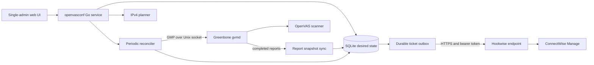

# openvasconf

[](https://github.com/arumes31/openvasconf/actions/workflows/ci.yml)
[](https://github.com/arumes31/openvasconf/actions/workflows/security.yml)
[](https://github.com/arumes31/openvasconf/actions/workflows/supply-chain.yml)
[](https://github.com/arumes31/openvasconf/actions/workflows/container.yml)

`openvasconf` is a small, single-admin control plane that turns customer IPv4
scope into recurring Greenbone/OpenVAS targets and scan tasks. It normalizes and
classifies addresses, packs multiple networks into targets of no more than 4,095
unique IPs, assigns each customer a weekly scan slot, and continuously reconciles
the desired configuration through GMP.

> [!IMPORTANT]
> This project and Greenbone's Community Container stack are intended for testing
> and familiarization. Greenbone explicitly does not recommend that container
> setup for production. Check the workflow badges before using a revision and
> only scan networks for which you have explicit authorization.

## Table of contents

- [What it creates](#what-it-creates)
- [Planning rules](#planning-rules)
- [Architecture](#architecture)
- [Requirements](#requirements)
- [Quick start with Greenbone](#quick-start-with-greenbone)
- [First-run configuration](#first-run-configuration)
- [Usage guide](#usage-guide)
- [Reconciliation and deletion](#reconciliation-and-deletion)
- [Configuration reference](#configuration-reference)
- [Operations](#operations)
- [Hookwise ticket integration](#hookwise-ticket-integration)
- [Security](#security)
- [Backup, restore, and upgrades](#backup-restore-and-upgrades)
- [Troubleshooting](#troubleshooting)
- [Development](#development)
- [GitHub automation and releases](#github-automation-and-releases)
- [Current scope and limitations](#current-scope-and-limitations)

## What it creates

For every active customer, `openvasconf` manages:

- one persistent weekly schedule named `Customer_Weekly_Schedule`;
- one or more private targets named `Customer_PrivateIP_TargetN`;
- matching private tasks named `Customer_PrivateIP_TaskN`;
- one or more public targets named `Customer_WAN_TargetN`;
- matching public tasks named `Customer_WAN_TaskN`;
- local ownership mappings, desired-state hashes, audit events, and reconciliation
  history in SQLite.

The scanner, scan configuration, and port list are global defaults with optional
per-customer overrides. The initial automatic selections are:

| Setting | Initial exact-name selection |
|---|---|
| Scanner | `OpenVAS Default` |
| Scan configuration | `Full and fast` |
| Port list | `All IANA assigned TCP` |

Automatic selection succeeds only after the Greenbone feeds have imported those
objects. All selections can be changed in **Greenbone settings**.

## Planning rules

The preview and reconciler use the same deterministic network plan:

1. Only IPv4 is accepted.
2. A bare address is stored as `/32`; for example, `192.168.10.0` means
   `192.168.10.0/32`, not `/24`.
3. An entry can include a trailing `#` comment, such as
   `192.168.0.0/24 # LAN`; comments are retained for editing but excluded from
   planning and scans.
4. An inclusive `start-end` IPv4 range such as `192.168.20.10-192.168.20.30` is
   converted into the smallest exact set of CIDRs before planning.
5. Prefixes broader than `/24` are split into `/24` entries.
6. Duplicate and overlapping coverage is scanned once.
7. RFC1918 space is grouped as `PrivateIP`; public global-unicast space is
   grouped as `WAN`.
8. Private and WAN entries are never mixed in the same target.
9. WAN targets use Greenbone's **Consider Hosts as Alive** setting; private
   targets retain Greenbone's default alive-test behavior.
10. A target can contain multiple prefixes, but never more than 4,095 unique IPs.
11. Special-use ranges such as loopback, link-local, CGNAT, documentation,
   multicast, and reserved space are rejected.

Single hosts remain canonical `/32` values in SQLite. They are sent to current
`gvmd` versions as bare IPv4 addresses because GMP target host specifications
reject the `/32` suffix.

### Example

Creating `testcomp1` with:

```text
10.1.0.0/16
192.168.10.0
7.7.7.7/32
```

produces 18 private target/task pairs and one WAN pair. The `/16` expands to 256
`/24` entries, the bare `192.168.10.0` becomes one private `/32`, and the public
address becomes one WAN `/32`.

Every task for the customer uses the same weekly schedule. New customers receive
a cryptographically random minute and weekday from the global policy, which
defaults to Monday through Thursday, 07:00–15:00 in `Europe/Vienna`. The policy
accepts any combination of weekdays and any start/end time within one day;
overnight operation is represented with two same-day windows.

## Architecture



The app is a statically compiled Go service. HTML, CSS, and JavaScript are
embedded in the binary. The container runs as UID/GID `1001`, drops all Linux
capabilities, uses a read-only root filesystem, and writes only to `/data` and a
small `/tmp` tmpfs. GMP credentials are used over the shared `gvmd` Unix socket;
the application does not expose Greenbone's database.

## Requirements

For the complete local test stack:

- a Linux host supported by the
  [Greenbone Community Container guide](https://greenbone.github.io/docs/latest/22.4/container/index.html),
  or a compatible Docker environment;
- Docker Engine and Docker Compose v2;
- network routing from the `ospd-openvas` scanner container to every customer
  subnet that will be scanned;
- explicit permission to scan each supplied address range.

Greenbone's published sizing is:

| Resource | Minimum | Recommended |
|---|---:|---:|
| CPU | 2 cores | 4 cores |
| RAM | 4 GB | 8 GB |
| Free storage | 20 GB | 60 GB |

The Greenbone services use the images published at
`registry.community.greenbone.net/community`. Running `docker compose pull`
retrieves the current image behind each upstream tag.

## Quick start with Greenbone

The complete test deployment is defined in one tracked file:
[`deploy/greenbone-compose.yaml`](deploy/greenbone-compose.yaml). It uses
Greenbone's published Community Container images directly and includes the
published `openvasconf` image in the same Compose project. No overlay is used.

### 1. Clone and prepare directories

```bash
git clone https://github.com/arumes31/openvasconf.git
cd openvasconf
mkdir -p secrets
chmod 700 secrets
```

PowerShell:

```powershell
git clone https://github.com/arumes31/openvasconf.git
Set-Location openvasconf
New-Item -ItemType Directory -Force secrets | Out-Null
```

### 2. Create secrets

Create two single-line password files and one independent 32-byte encryption
key:

| File | Used for |
|---|---|
| `secrets/admin_password` | Local `openvasconf` user `admin` |
| `secrets/gmp_password` | Greenbone/GMP user, `admin` by default |
| `secrets/hookwise_encryption_key` | AES-256 key for the stored Hookwise bearer token |

Linux/macOS example:

```bash
printf '%s' 'replace-with-a-strong-local-password' > secrets/admin_password
printf '%s' 'replace-with-a-different-gmp-password' > secrets/gmp_password
openssl rand -base64 32 > secrets/hookwise_encryption_key
chmod 600 secrets/*
```

PowerShell example:

```powershell
Set-Content -NoNewline secrets/admin_password '<strong-local-password>'
Set-Content -NoNewline secrets/gmp_password '<different-strong-gmp-password>'
$key = New-Object byte[] 32
[Security.Cryptography.RandomNumberGenerator]::Fill($key)
Set-Content -NoNewline secrets/hookwise_encryption_key ([Convert]::ToBase64String($key))
```

Do not commit these files. The app password bootstraps the local account only
when the database is new; changing the file later does not rotate an existing
account.

### 3. Start the complete stack

Pull first so image-download failures are separate from service startup:

```bash
docker compose -f deploy/greenbone-compose.yaml pull
docker compose -f deploy/greenbone-compose.yaml up -d
```

PowerShell:

```powershell
docker compose -f deploy/greenbone-compose.yaml pull
docker compose -f deploy/greenbone-compose.yaml up -d
```

The one-shot `gvmd-user-init` service runs as the Linux `gvmd` user and applies
`secrets/gmp_password` to the Greenbone account before `openvasconf` starts. A
database or password-update error fails the initializer and blocks dependent
services instead of silently starting with mismatched credentials.

After changing `secrets/gmp_password`, recreate the initializer and application:

```bash
docker compose -f deploy/greenbone-compose.yaml up -d --force-recreate \
  gvmd-user-init openvasconf
```

This starts Greenbone and `openvasconf` together. For a repeatable app version,
set `OPENVASCONF_IMAGE` to the verified digest from the `image-digest` workflow
artifact before running `pull` and `up`:

```bash
export OPENVASCONF_IMAGE='ghcr.io/arumes31/openvasconf@sha256:REPLACE_WITH_DIGEST'
```

PowerShell:

```powershell
$env:OPENVASCONF_IMAGE = `
  'ghcr.io/arumes31/openvasconf@sha256:REPLACE_WITH_DIGEST'
```

The default `edge` tag is intended only for testing. If the package is private,
authenticate first with `docker login ghcr.io`.

### 4. Wait for Greenbone feeds

Initial feed import can take a substantial amount of time. Follow the logs:

```bash
docker compose -f deploy/greenbone-compose.yaml logs -f
```

Stop following logs with `Ctrl+C`; the containers keep running. Greenbone is
ready for full configuration when GSA shows the scanner, scan configurations,
port lists, and feed data. See Greenbone's
  [feed synchronization guide](https://greenbone.github.io/docs/latest/22.4/container/workflows.html#performing-a-feed-synchronization)
if objects remain unavailable.

Open:

- `openvasconf`: <http://127.0.0.1:8080>
- Greenbone Security Assistant: <https://127.0.0.1> or
  <https://127.0.0.1:9392> with the current official file

The Greenbone test certificate is self-signed. Both interfaces bind to loopback
by default and are not reachable from another machine.

### 5. Verify service health

```bash
curl --fail http://127.0.0.1:8080/health/live
curl --fail http://127.0.0.1:8080/health/ready
```

- `/health/live` returns HTTP 200 when the web process is alive.
- `/health/ready` returns HTTP 200 only when SQLite and Greenbone respond; it
  returns HTTP 503 while GMP is unavailable.

## First-run configuration

1. Log in with username `admin` and the contents of
   `secrets/admin_password`.
2. Open **Greenbone** and select **Test Greenbone connection**.
3. Review the global scanner, scan configuration, and port list. If they are
   blank, wait for feed import and try again.
4. Set the IANA timezone used for new customers.
5. Choose the allowed weekdays and time window. Any weekday combination and any
   same-day start/end time between 00:00 and 23:59 is accepted.
6. Save the global defaults.
7. Optional: configure customer CIDs and the global Hookwise endpoint as
   described in [Hookwise ticket integration](#hookwise-ticket-integration).

Changing the global schedule policy does not silently move existing customer
slots. Existing schedules remain stable and are marked as outside policy when
appropriate; use **Randomize schedule** or edit the customer to move one.

## Usage guide

### Add a customer

1. Select **Add customer**.
2. Enter a unique name of 1–100 characters. The Greenbone-safe form is limited
   to 64 ASCII letters, digits, hyphens, and underscores.
3. Optionally add a description of up to 500 characters and up to 10 normalized
   tags of 30 characters each.
4. Enter one IPv4 address, CIDR, or inclusive `start-end` range per line.
   Comma-separated input is also accepted. A `.txt` or `.csv` file can populate
   the field in the browser. Add a trailing `#` comment to label an entry.
   Ranges are converted to the smallest exact set of CIDRs.
5. Keep the randomized weekly slot or choose any weekday and time of day.
6. Keep the global scanner/config/port-list values or select customer overrides.
7. Select **Review generated changes**, inspect normalization, overlap warnings,
   target utilization, and the before/after summary.
8. Confirm to save the desired state and queue reconciliation.

The browser review token is signed, expires after 15 minutes, and includes the
customer revision so a stale edit cannot overwrite a newer browser edit.

### Understand customer state

| State | Meaning |
|---|---|
| `pending` | Desired state changed and has not been fully applied. |
| `syncing` | A reconciliation run is active. |
| `applied` | Every desired object is checkpointed successfully. |
| `error` | The last run stopped; open technical detail or history. |

The dashboard shows desired revision, progress, retry state, next scan date,
effective policy objects, and the latest successful reconciliation. Use **Check
remote drift** to compare local mappings with remote existence and ownership.

### Synchronize and retry

- **Synchronize all** queues every customer, including deleted rows awaiting
  cleanup.
- A row's **Sync** or **Retry** action queues one customer.
- **Synchronize selected** operates on checked rows in the current filtered view.
- The background reconciler also runs at startup and every minute by default.

Transient network and GMP 5xx failures receive up to three attempts with short
exponential backoff. Non-transient rejections stop immediately and remain
visible as `error`.

### Start an unscheduled scan

Open an applied customer and select **Start scan** beside a managed task. Before
starting it, `openvasconf` verifies that the task exists and still contains this
installation's ownership marker. The recurring weekly schedule remains intact.

### Clone a customer

**Clone customer** creates a new customer with copied metadata, networks,
schedule, and policy overrides. The name is suffixed with `Copy` and made unique;
new Greenbone objects are created under the clone's own ownership markers.

### Import and export

**Portability** downloads a versioned JSON document containing global settings
and all active customers. Import is validate-and-preview-before-apply with these
limits:

- 1 MiB upload;
- 500 customers per document;
- 2,000 network definitions per customer;
- JSON version `1` only;
- unknown JSON fields are rejected.

Existing customers match by ID, or by case-insensitive name when the imported ID
is empty. Omitted customers are never deleted. Import is not a restore of deleted
local rows and does not include credentials, sessions, history, ownership
mappings, or Greenbone reports.

## Reconciliation and deletion

Reconciliation is idempotent: unchanged applied resources cause no Greenbone
writes. For new or changed desired state, it creates or modifies the schedule,
targets, and tasks and stores a checkpoint after each successful operation. If a
remote object was created but the local checkpoint was interrupted, the next run
can recover it by its unique ownership marker.

Every managed object's Greenbone comment contains an installation/customer
ownership marker. Before modifying or deleting a mapped object, the reconciler
reads the remote comment. A missing or different marker stops the operation
instead of touching an object it cannot prove it owns.

Greenbone cannot safely mutate every referenced target/task field in place. When
networks, port lists, scan configurations, scanners, or schedules require a task
replacement, the old owned task is moved to Greenbone trash and a deterministic
replacement is created.

### Removing networks

After the edit review is confirmed, surplus owned tasks are moved to trash first,
then surplus targets. The customer's one weekly schedule remains while the
customer remains active.

### Removing a customer

The local row is soft-deleted immediately and disappears from the normal web UI.
The next reconciliation moves owned tasks, targets, and schedule to Greenbone
trash in dependency order. GMP deletion uses `ultimate=0`; `openvasconf` never
permanently purges Greenbone objects.

> [!NOTE]
> Greenbone trash preserves the remote objects, but this version has no web action
> to restore a soft-deleted local customer. Recovery must be handled from a
> database backup and coordinated with the Greenbone trash state. Do not describe
> the delete button as a complete one-click undo.

## Configuration reference

Duration values use Go syntax such as `30s`, `1m`, or `12h`.

| Environment variable | Default | Purpose |
|---|---|---|
| `OPENVASCONF_LISTEN` | `127.0.0.1:8080` | HTTP listen address. Compose sets `0.0.0.0:8080` inside the container but publishes it on host loopback. |
| `OPENVASCONF_DATABASE` | `data/openvasconf.db` | SQLite database path. |
| `OPENVASCONF_GMP_SOCKET` | `/run/gvmd/gvmd.sock` | `gvmd` Unix socket. |
| `OPENVASCONF_UPDATER_SOCKET` | `/run/openvasconf-updater/updater.sock` | Private Unix socket for the optional updater helper. |
| `OPENVASCONF_GMP_USERNAME` | `admin` | GMP username. |
| `OPENVASCONF_GMP_PASSWORD_FILE` | none | Preferred file containing the GMP password. |
| `OPENVASCONF_GMP_PASSWORD` | empty | Direct GMP password fallback for development. |
| `OPENVASCONF_ADMIN_PASSWORD_FILE` | none | Preferred local bootstrap-password file. |
| `OPENVASCONF_ADMIN_PASSWORD` | empty | Direct local bootstrap-password fallback for development. |
| `OPENVASCONF_HOOKWISE_ENCRYPTION_KEY_FILE` | none | Preferred file containing 32 raw bytes, or base64 for 32 bytes, used to encrypt the Hookwise bearer token. |
| `OPENVASCONF_HOOKWISE_ENCRYPTION_KEY` | empty | Direct encryption-key fallback for development. |
| `OPENVASCONF_TIMEZONE` | `Europe/Vienna` | Initial schedule timezone for a new database. |
| `OPENVASCONF_RECONCILE_INTERVAL` | `1m` | Full drift-reconciliation interval. |
| `OPENVASCONF_EXTERNAL_TIMEOUT` | `15s` | Maximum idle time for ordinary GMP calls. |
| `OPENVASCONF_SESSION_LIFETIME` | `12h` | Local admin session lifetime. |
| `OPENVASCONF_SECURE_COOKIES` | `false` | Always mark session and CSRF cookies `Secure`. |
| `OPENVASCONF_TRUST_PROXY_TLS` | `false` | Trust `X-Forwarded-Proto: https` when deciding whether cookies are secure. |
| `OPENVASCONF_REPORT_SYNC_INTERVAL` | `2m` | Completed-report discovery and import interval. |
| `OPENVASCONF_REPORT_FETCH_TIMEOUT` | `5m` | Maximum idle time while fetching a report from GMP. |
| `OPENVASCONF_REPORT_MAX_XML_BYTES` | `67108864` | Maximum accepted report XML size in bytes. |
| `OPENVASCONF_REPORT_MAX_FINDINGS` | `50000` | Maximum findings imported from one report. |
| `OPENVASCONF_REPORT_IMPORT_CONCURRENCY` | `1` | Concurrent report imports. |
| `OPENVASCONF_EXPORT_MAX_ROWS` | `100000` | Maximum finding rows in one export. |
| `OPENVASCONF_EXPORT_MAX_BYTES` | `52428800` | Maximum export response size in bytes. |
| `OPENVASCONF_PORT` | `8080` | Compose-only host port substitution; it is not read by the Go process. |
| `OPENVASCONF_UPDATER_IMAGE` | required | Updater helper image as an approved immutable `repository@sha256:<digest>` reference; mutable tags are rejected. |
| `OPENVASCONF_DOCKER_GID` | `999` | Compose-only supplemental group matching the host Docker socket GID. |

File-based secrets take precedence over direct values. The admin password must
contain at least 12 characters. All configured durations must be positive, and
the timezone must be a valid IANA name.

The Hookwise encryption key protects the bearer token stored in SQLite. It is
not the Hookwise bearer token and it is not an HMAC secret. Preserve the key with
the database backup. Replacing or losing it makes the existing stored token
undecryptable; after an intentional key rotation, restart `openvasconf`, enter
the Hookwise bearer token again, save the settings, and test the connection.

Run `openvasconf validate-config` to verify the same configuration and secret
references used at startup without starting the HTTP server or connecting to
SQLite or Greenbone. It prints every discovered problem, never prints secret
values, exits `0` when the configuration is valid, and exits `1` otherwise.

The single deployment file exposes the commonly changed username, timezone,
port, and secure-cookie settings. Set additional supported variables through a
local `.env` file or the shell when needed; keep passwords in the files under
`secrets/` rather than in Compose or environment files.

## Operations

### Logs and status

```bash
docker compose -f deploy/greenbone-compose.yaml ps
docker compose -f deploy/greenbone-compose.yaml logs --tail=200 openvasconf
docker compose -f deploy/greenbone-compose.yaml logs --tail=200 openvasconf-updater
docker compose -f deploy/greenbone-compose.yaml logs --tail=200 gvmd
```

Application logs are structured JSON on stdout. The web UI adds live GMP
latency, feed version/age, active task state, latest report severity, per-resource
drift, and reconciliation history.

Every authenticated page carries a system-health strip summarizing database,
Greenbone, feed, reconciliation, and report-synchronization state. Green means
all components healthy, amber means the service is usable but a component is
stale or degraded, and red means the database or Greenbone is unavailable. The
strip expands to per-component details, check timestamps, and recovery guidance.

Running tasks expose a confirmation-guarded **Stop scan** action on the customer
page. After the GMP stop request is sent, the displayed state keeps coming from
Greenbone polling; the stop is only confirmed once Greenbone reports it.

### Feed and stack updates

The **Updates** workspace monitors helper, image, feed, schedule, and durable
operation state. Feed refreshes can run daily. Greenbone service upgrades run in
a configured weekly maintenance window and defer while scans are active.

`openvasconf-updater` is the only component that mounts the Docker socket. The
web application talks to it over a private Unix socket and can request only fixed
check, feed-refresh, stack-upgrade, and acknowledgement operations. Requests
cannot supply commands, Compose paths, services, images, registries, or flags.

Before a stack upgrade, the helper records the running image digests and writes a
Greenbone PostgreSQL checkpoint to its protected backup volume. It pulls only
allowlisted Greenbone Community images, recreates only the Greenbone service
set, and verifies GMP/feed availability. Failed verification restores the prior
images and database checkpoint, then pauses stack automation until an admin
reviews and acknowledges the result.

Deployment-only services, including `gvmd-user-init`, `openvasconf`, and the
updater helper itself, are never recreated by an automated Greenbone upgrade.

Set the Docker socket group before starting the complete deployment:

```bash
export OPENVASCONF_DOCKER_GID="$(stat -c '%g' /var/run/docker.sock)"
export OPENVASCONF_UPDATER_IMAGE='ghcr.io/arumes31/openvasconf-updater@sha256:<reviewed-manifest-digest>'
docker compose -f deploy/greenbone-compose.yaml up -d
```

The updater uses Greenbone's documented container workflow: pull the dedicated
feed data images, start those data containers, then wait for the Greenbone
daemons to finish importing the data. Do not combine this with a separate
`greenbone-feed-sync` job against the same volumes.

### Scan reports

`openvasconf` periodically discovers completed Greenbone reports for managed
tasks and imports normalized, immutable snapshots (findings, severities, and
metadata); raw report XML is discarded after parsing and never stored. Imports
are transactional and idempotent per Greenbone report ID, with bounded retries
for failures.

The **Reports** pages show per-scan severity distribution, finding counts, and
severity trends, and classify findings as new, recurring, or resolved against
the previous snapshot of the same managed task. Any two snapshots of one task
can be compared explicitly. Each finding can carry an operator annotation —
false positive or accepted risk with justification and optional expiry, plus
remediation owner, status, and due date — which survives across later scans.
Severity-based remediation SLAs (configurable in Greenbone settings) derive due
dates from a finding's first-seen scan, and expired risk acceptances return to
active automatically. Filtered findings can be exported as CSV, JSON, PDF, or
SARIF; SARIF uses the stable finding fingerprints as result identity.

The **Findings** page is the operational current-exposure view. It selects the
latest successful snapshot of every managed task and shows one row per exact
task-scoped fingerprint. Marking a row resolved or wont-fix suppresses it from
current and future views until it is manually reopened; historical snapshots
remain immutable.

Authenticated JSON endpoints used by the web UI are:

| Endpoint | Purpose |
|---|---|
| `GET /api/status` | SQLite/GMP availability and GMP version |
| `GET /api/options` | Available scanners, scan configs, and port lists |
| `GET /api/operations` | Feed and task activity |
| `POST /api/preview` | Network-plan preview |
| `GET /api/customers/{id}/progress` | Reconciliation progress |
| `GET /api/customers/{id}/drift` | Remote ownership/existence check |

These endpoints require the browser session; mutating POST requests also require
the CSRF token. They are not a separately versioned public API.

### Query GMP directly

```bash
docker compose -f deploy/greenbone-compose.yaml run --rm gvm-tools \
  gvm-cli socket --xml '<get_version/>'
```

Use this to separate GMP/socket problems from application behavior.

### Stop without deleting data

```bash
docker compose -f deploy/greenbone-compose.yaml down
```

Do not add `--volumes` unless you intentionally want to destroy the Greenbone
feeds, databases, scan data, and the `openvasconf` SQLite volume.

## Hookwise ticket integration

[`Hookwise`](https://github.com/arumes31/hookwise) receives finding lifecycle
events from `openvasconf` and creates, updates, or closes customer-routed
ConnectWise Manage tickets. One global Hookwise endpoint is shared by all
customers; the `cid` on each customer selects the ConnectWise company.

### Ticket eligibility and lifecycle

Ticket identity is the customer, managed task, and stable finding fingerprint.
The ticket summary contains a shortened fingerprint plus host and port because
Hookwise uses the final summary for duplicate detection and close-event lookup.

| Current finding state | Ticket action |
|---|---|
| Present in the latest successful task snapshot, severity `>= 7.0`, active, and not resolved/wont-fix | Queue `state: open` if no open generation has been delivered. |
| Eligible but customer CID is empty | Set ticket state to `blocked`; no webhook is sent. |
| Missing from the next successful snapshot of the same task | Queue `state: closed`. |
| Severity drops below `7.0` | Queue `state: closed`. |
| Marked resolved or wont-fix | Hide it from the current view and queue `state: closed`. |
| Classified as false positive or accepted risk through report annotation | Queue `state: closed` while that disposition is active. |
| Reopened or becomes eligible again later | Start a new ticket generation and queue another `state: open`. |

An interrupted or failed scan does not prove that a finding disappeared. Only a
successfully imported newer snapshot can cause the absence transition. Historical
report snapshots remain immutable when a current finding is suppressed or
closed.

### 1. Prepare the openvasconf encryption key

The standard Compose files already mount
`secrets/hookwise_encryption_key` through
`OPENVASCONF_HOOKWISE_ENCRYPTION_KEY_FILE`. Create it before the first startup:

```bash
mkdir -p secrets
openssl rand -base64 32 > secrets/hookwise_encryption_key
chmod 600 secrets/hookwise_encryption_key
```

PowerShell:

```powershell
New-Item -ItemType Directory -Force secrets | Out-Null
$key = New-Object byte[] 32
[Security.Cryptography.RandomNumberGenerator]::Fill($key)
Set-Content -NoNewline secrets/hookwise_encryption_key `
  ([Convert]::ToBase64String($key))
```

The decoded value must be exactly 32 bytes. `openvasconf validate-config`
validates the file without printing it. The key encrypts the Hookwise bearer
token with AES-256-GCM before the token is written to SQLite. The UI never
renders the stored token back to the browser.

### 2. Create the Hookwise endpoint

Deploy Hookwise and complete its ConnectWise connection first. In Hookwise,
select **New Endpoint** and use this recipe:

| Hookwise field | Recommended value for openvasconf |
|---|---|
| Endpoint Name | `openvasconf findings` |
| Service Board | The board that should receive vulnerability tickets. |
| Priority | A valid priority on that ConnectWise installation. Hookwise may also derive it from the mapped severity. |
| Default Company | Optional safety fallback. Normal routing uses `$.cid`; openvasconf blocks events without a CID before delivery. |
| Initial Status | A valid open status on the selected board. |
| Close Status | A valid closed status such as `Completed` or `Closed`. |
| Summary Prefix | Keep stable after tickets are opened. Hookwise includes it in duplicate and close matching. |
| Trigger Field | `$.state` |
| Open Value | `open` |
| Close Value | `closed,connection_test` |
| Bearer Token Authentication | Enabled. |
| HMAC Secret | Leave empty; openvasconf authenticates with the bearer token and does not send `X-HookWise-Signature`. |
| Trusted IPs | Optional. If enabled, allow the source address Hookwise sees after any reverse proxy. |
| Endpoint state | Enabled and not left as a draft. |

Hookwise accepts comma-separated trigger values. Including `connection_test` in
the close values makes the openvasconf connection test a harmless close/no-op
instead of a generic alert on Hookwise versions that process unmatched states.

Set **JSON Mapping** to:

```json
{
  "summary": "$.summary",
  "description": "$.description",
  "customer_id": "$.cid",
  "severity": "$.severity"
}
```

Do not map the Hookwise summary from `$.title`. NVT titles may change between
feed versions, whereas the `$.summary` emitted by openvasconf is deliberately
fingerprint-stable so the later close event can find the original ticket.

Save the endpoint. Its edit page displays both values needed by openvasconf:

- the endpoint URL, normally `https://hookwise.example/w/<endpoint-id>`;
- the generated bearer token under **Token Management**.

Copy the complete URL shown by Hookwise. Do not reconstruct it from older
examples that use `/webhook/<id>`; current Hookwise routes and its endpoint form
use `/w/<id>`. Token regeneration is immediate. If it is regenerated, update
openvasconf before retrying queued events.

### 3. Configure customer routing CIDs

For every customer that should create tickets:

1. Open the customer in `openvasconf`.
2. Set **Hookwise customer CID** to the exact ConnectWise company identifier,
   not the local openvasconf UUID or display name.
3. Review and confirm the customer change.

CIDs are optional globally, limited to 100 characters, and may contain letters,
numbers, `.`, `_`, `:`, and `-`. An eligible High/Critical finding without a CID
is retained with ticket state `blocked`. Adding the CID later causes the next
ticket reconciliation pass to queue the open event; the finding is not lost.

### 4. Connect openvasconf to Hookwise

1. Log in to `openvasconf` and open **Greenbone**.
2. In **Hookwise integration**, enter the complete `/w/<endpoint-id>` URL.
3. Paste the Hookwise bearer token. It is write-only; leaving the field blank on
   a later save preserves the stored token.
4. Enable **ticket synchronization** and select **Save Hookwise settings**.
5. Select **Test connection**.
6. Check Hookwise **History** and confirm the `connection_test` event was
   accepted without creating a ticket.
7. Import or refresh a successful report containing an eligible finding and
   verify the resulting ConnectWise ticket and company routing.

The endpoint must be reachable from the `openvasconf` container. `localhost`
inside that container refers to the container itself. When both applications
share a Docker network, use the Hookwise service DNS name and port; otherwise use
a routed HTTPS hostname. Hookwise redirects are not followed, embedded URL
credentials are rejected, TLS must be version 1.2 or newer, and private/self-
signed certificate authorities must be trusted by the container. There is no
insecure TLS switch.

### Webhook payload

An open event resembles:

```json
{
  "event_id": "customer-id:task-id:v1:fingerprint:1:open",
  "state": "open",
  "cid": "CUSTOMER-CID",
  "finding_key": "customer-id:task-id:v1:fingerprint",
  "customer": "Example customer",
  "customer_id": "customer-id",
  "task": "Example_PrivateIP_Task1",
  "task_id": "task-id",
  "fingerprint": "v1:fingerprint",
  "summary": "[OpenVAS] Finding v1:fingerpri on 10.20.30.40:443/tcp",
  "description": "Finding title and remediation context",
  "title": "Finding title",
  "host": "10.20.30.40",
  "port": "443/tcp",
  "severity": 8.8,
  "cves": ["CVE-2026-1234"],
  "remediation": "Install the fixed version",
  "resolution": "",
  "remediation_state": "open",
  "report_path": "/reports/123"
}
```

A close event uses the same stable finding identity and summary, changes
`state` to `closed`, and includes the current resolution/remediation state.
`report_path` is relative to the openvasconf UI and is not automatically an
externally reachable URL.

### Delivery guarantees and monitoring

- Events are first committed to the SQLite outbox; application restarts do not
  discard them.
- Reconciliation and delivery run on changes and every 30 seconds, with at most
  20 due events handled per pass in creation order.
- Any HTTP `2xx` response marks the webhook event delivered. Redirects and all
  other statuses are failures. At most 4 KiB of an error response is retained.
- Failed events retry after 1, 2, 4, 8 minutes and so on, capped at 256 minutes.
  **Retry failed events** makes all pending failures immediately eligible.
- The settings page shows pending, retrying, and last-delivered state. The
  Findings page shows `blocked`, `queued_open`, `open`, `queued_close`, `closed`,
  and `failed` per finding.
- Rotating the bearer token does not rewrite queued payloads. Save the new token
  in openvasconf and then select **Retry failed events**.

Hookwise normally returns `202 Accepted` after queuing work. That confirms
ingestion and authentication, not successful asynchronous ConnectWise ticket
creation. openvasconf therefore reports webhook delivery health, while Hookwise
**History**, worker logs, and ConnectWise remain authoritative for downstream
processing failures.

### Hookwise troubleshooting

| Symptom | Check |
|---|---|
| `ticket integration incomplete` | Confirm the 32-byte deployment encryption key, endpoint URL, saved bearer token, and enabled checkbox. |
| Connection test fails | Test DNS and TCP/TLS reachability from the openvasconf container; check the `/w/<id>` URL, bearer token, Hookwise trusted-IP rule, certificate chain, and redirects. |
| Connection test creates a ticket | Add `connection_test` to Hookwise **Close Value** or add an equivalent drop routing rule for `$.state`. |
| Finding shows `blocked` | Set a valid CID on the customer and save the reviewed customer change. |
| Finding shows `failed` or settings show retrying events | Inspect openvasconf logs for HTTP status/diagnostic, correct the endpoint or token, then select **Retry failed events**. |
| openvasconf says delivered but no ticket exists | Inspect Hookwise History and worker logs. A `2xx`/`202` only confirms ingestion; verify ConnectWise board, status, priority, company ID, and API permissions. |
| Ticket is assigned to the wrong company | Ensure JSON mapping contains `"customer_id": "$.cid"` and the openvasconf CID exactly matches the ConnectWise company identifier. |
| Ticket does not close | Verify trigger `$.state`, close value `closed`, a valid Hookwise Close Status, and an unchanged summary prefix. Check whether the ConnectWise ticket summary was edited manually. |
| Duplicate tickets appear | Keep the JSON summary mapping and Hookwise prefix stable; verify Hookwise can still query the original open ticket. |
| Stored token becomes undecryptable after restart | Restore the matching encryption key or enter the Hookwise token again under the new key and save. |

## Security

- The application has one fixed username, `admin`; it has no RBAC or customer
  user accounts.
- Passwords are bcrypt-hashed at cost 12. Session tokens are random, stored only
  as SHA-256 hashes, and expire after 12 hours by default.
- Login is limited to five failed attempts per source address in 15 minutes.
- Cookies are `HttpOnly` and `SameSite=Strict`; POST forms use a double-submit
  CSRF token and request bodies are limited to 1 MiB.
- Responses set a restrictive Content Security Policy, deny framing, disable
  MIME sniffing, and use `Cache-Control: no-store`.
- The default Compose port is host-loopback only. For remote access, place the
  app behind an authenticated HTTPS reverse proxy and set secure cookies.
- Set `OPENVASCONF_TRUST_PROXY_TLS=true` only when a trusted proxy overwrites the
  forwarded-protocol header; never trust a client-supplied header directly.
- SQLite contains customer scope, resource IDs, ownership mappings, and audit
  history. Backups must be protected as sensitive operational data.
- The scanner needs routes to customer networks. Firewall that reachability to
  approved destinations and keep authorization records outside this tool.

Report vulnerabilities through GitHub private vulnerability reporting as
described in [`SECURITY.md`](SECURITY.md). Never put credentials, customer
addresses, scanner results, or exploit detail in a public issue.

## Backup, restore, and upgrades

### Back up

The official Compose project name makes the app volume
`greenbone-community-edition_openvasconf_data`. Confirm it before copying:

```bash
docker volume inspect greenbone-community-edition_openvasconf_data
docker run --rm \
  -v greenbone-community-edition_openvasconf_data:/source:ro \
  -v "$PWD:/backup" \
  alpine:3.22 tar czf /backup/openvasconf-data.tgz -C /source .
```

PowerShell:

```powershell
docker volume inspect greenbone-community-edition_openvasconf_data
docker run --rm `
  -v greenbone-community-edition_openvasconf_data:/source:ro `
  -v ${PWD}:/backup `
  alpine:3.22 tar czf /backup/openvasconf-data.tgz -C /source .
```

For a transactionally consistent backup, stop `openvasconf` first or use an
SQLite-aware backup process. Preserve the database together with its WAL/SHM
files if copying while the service is stopped.

The database is essential: it holds the installation ID and the proof mapping
local rows to Greenbone objects. Losing it causes a replacement installation to
refuse ownership of existing remote objects rather than adopting them silently.

### Restore

1. Stop `openvasconf`.
2. Verify the destination volume name and ensure it is empty.
3. Extract the archive into that volume.
4. Start the service and inspect drift before synchronizing.

Coordinate a restore with Greenbone's current state. Restoring an older SQLite
snapshot can make newer remote resources appear unknown or surplus; ownership
checks prevent unsafe deletion, but operator review is still required.

### Upgrade

Greenbone feed and service upgrades should normally be managed from the
**Updates** workspace. The manual procedure below remains the break-glass path
and is also required when the upstream Compose topology itself changes.

1. Back up `openvasconf` and Greenbone data.
2. Pull the desired repository revision or verified image digest.
3. Review upstream Greenbone Community Container changes and update the tracked
   service definitions when required.
4. Run `docker compose -f deploy/greenbone-compose.yaml pull`.
5. Run `docker compose -f deploy/greenbone-compose.yaml up -d`.
6. Check `/health/ready`, logs, settings, and customer drift.

SQLite migrations run automatically on startup. Do not downgrade against a
database that has already received newer migrations unless that downgrade is
explicitly documented and tested.

## Troubleshooting

| Symptom | Likely cause and action |
|---|---|
| `GMP socket unavailable` | `gvmd` is still starting, the socket volume is not shared, or its group differs. Inspect `/run/gvmd/gvmd.sock` from `gvm-tools` and compare its group with the `openvasconf` service's `group_add` value in the tracked Compose file. |
| GMP authentication fails | Make `secrets/gmp_password` exactly match the password set with `gvmd --new-password`, then recreate the app container. |
| Scanner/config/port-list options are empty | Greenbone feed data is still importing. Follow Greenbone logs and wait for the data objects to appear in GSA. |
| Customer remains `pending` | Trigger synchronization, then inspect progress and app logs. Missing global defaults commonly block the first run. |
| Customer is `error` | Open reconciliation history. Safe text is operator-facing; technical detail contains the underlying GMP or network error. |
| Ownership mismatch | The mapped remote object's marker changed. `openvasconf` intentionally stops. Do not edit SQLite to bypass it; determine who changed the Greenbone object and recover from a trusted mapping/backup. |
| Target update fails because a task references it | Re-run reconciliation. The reconciler normally trashes the owned task, updates the target, and creates a replacement. |
| `/health/live` is 200 but `/health/ready` is 503 | The web process and SQLite may be healthy while GMP is not. Query `<get_version/>` with `gvm-tools`. |
| Login password file changed but old password still works | The file is bootstrap-only. Existing admin hashes are not automatically rotated. |
| Browser repeatedly returns `invalid request token` | Cookies are missing, stale, or marked Secure on plain HTTP. Reload the login page and verify the proxy/TLS cookie settings. |
| Scanner cannot reach a customer subnet | Fix Docker host routing, VPN routes, firewall rules, and scanner-container reachability; the control plane does not create network routes. |

## Development

### Toolchain

- Go version from [`go.mod`](go.mod) (currently Go 1.26)
- Docker with BuildKit/Buildx
- Node.js 24 and npm only when reproducing the minified browser asset locally

### Run from source

Live GMP operation requires a reachable Unix socket, so native execution is most
useful on Linux:

```bash
export OPENVASCONF_ADMIN_PASSWORD='development-password-only'
export OPENVASCONF_GMP_PASSWORD='matching-greenbone-password'
export OPENVASCONF_GMP_SOCKET='/run/gvmd/gvmd.sock'
export OPENVASCONF_DATABASE='data/openvasconf.db'
go run ./cmd/openvasconf
```

Direct password environment variables are development fallbacks. Prefer secret
files for any persistent deployment.

### Test and build

```bash
gofmt -w $(find . -name '*.go' -not -path './.git/*')
go vet ./...
go test -shuffle=on ./...
go test -race ./...
go test -covermode=atomic -coverprofile=coverage.out ./...
go tool cover -func=coverage.out
docker build -t openvasconf:test .
docker compose -f deploy/greenbone-compose.yaml config
```

PowerShell formatting command:

```powershell
gofmt -w (rg --files -g '*.go')
```

The test suite uses fake GMP connections and temporary SQLite databases; it does
not require a live scanner. A live test deployment is still required to validate
feed-dependent objects, socket permissions, routing, schedules, and real scan
execution. The repository test suite is maintained at the recommended 70%
statement-coverage level; use the coverage commands above to verify the exact
value for the checked-out revision.

### Frontend asset

The readable source is `internal/web/static/app.js`. The container uses the
exact esbuild version in `package-lock.json` to minify it in an isolated Node
stage, then embeds only the minified result in the Go binary. Node, npm,
`node_modules`, source maps, and readable JavaScript source are absent from the
runtime image.

```bash
npm ci --no-audit --no-fund
npm run build:assets
node scripts/check-npm-licenses.mjs
```

### Repository layout

| Path | Purpose |
|---|---|
| `cmd/openvasconf` | Process startup and graceful shutdown |
| `cmd/openvasconf-updater` | Isolated Docker/Compose update helper |
| `internal/auth` | Single-admin authentication and sessions |
| `internal/config` | Environment and secret-file configuration |
| `internal/customer` | Customer, scheduling, and portable document models |
| `internal/networkplan` | IPv4 normalization, classification, splitting, and packing |
| `internal/gmp` | GMP XML client over the `gvmd` Unix socket |
| `internal/reconcile` | Idempotent desired-state application and cleanup |
| `internal/store` | SQLite migrations, persistence, history, and ownership mappings |
| `internal/updater` | Update protocol, scheduler, state machine, Compose allowlist, backup, and rollback |
| `internal/web` | HTTP routes, security middleware, templates, and static assets |
| `deploy` | Single-file Greenbone and `openvasconf` test deployment |
| `.github/workflows` | CI, security, supply-chain, publication, and scheduled checks |

## GitHub automation and releases

The repository includes five fail-closed workflows:

- **CI** checks formatting, vet, golangci-lint, shuffled/repeated/race tests,
  coverage, deterministic minification, and the final runtime image.
- **Security** runs gosec, govulncheck, CodeQL, dependency review, Hadolint, and
  Trivy filesystem/image scans. Reports are retained even when a scanner fails.
- **Supply chain** verifies module tidiness, enforces Go/npm license allowlists,
  audits workflow syntax/security, and publishes OpenSSF Scorecard results.
- **Publish container** builds the application and updater helper for
  `linux/amd64` and `linux/arm64` with
  an SPDX SBOM, maximum provenance, GitHub artifact attestation, and keyless
  Cosign signature.
- **Weekly deep scan** runs repeated race tests, Go security scanners, and a
  no-cache image scan at 03:17 UTC each Monday or by manual dispatch.

All third-party actions use full commit SHAs and all Docker base images use
manifest digests. Dependabot checks Go, npm, Docker, and GitHub Actions weekly
and groups related updates.

### Publication rules

- The default branch publishes `edge` and `sha-<full-commit>`.
- A stable `v1.2.3` tag publishes `1.2.3`, `1.2`, `1`, `latest`, and the SHA tag.
- Prereleases do not move `latest`.
- Pull requests validate only; they never log in, publish, sign, or attest.

Publication calls the required CI, Security, and Supply chain workflows. It
first pushes an untagged immutable digest, attests and signs it, verifies the
signature, and scans both architectures. Public tags are attached only after
every gate succeeds. Unfixed high/critical vulnerabilities are not ignored.

### Verify a published image

Use the digest from the workflow's `image-digest` artifact:

```bash
IMAGE='ghcr.io/OWNER/REPOSITORY@sha256:DIGEST'
cosign verify \
  --certificate-identity-regexp '^https://github.com/OWNER/REPOSITORY/.github/workflows/container.yml@refs/(heads|tags)/.+$' \
  --certificate-oidc-issuer 'https://token.actions.githubusercontent.com' \
  "$IMAGE"
gh attestation verify "oci://$IMAGE" \
  --repo OWNER/REPOSITORY \
  --signer-workflow OWNER/REPOSITORY/.github/workflows/container.yml
docker buildx imagetools inspect "$IMAGE"
```

For this repository, replace `OWNER/REPOSITORY` with
`arumes31/openvasconf`. Deploy by digest after verification rather than relying
only on a mutable tag.

### Repository settings

Before making checks required, enable GitHub Actions, GHCR publishing,
read/write workflow access for `GITHUB_TOKEN`, dependency graph, Dependabot
alerts/security updates, code scanning, private vulnerability reporting, and
branch protection for `main`. Require CI, Security, and Supply chain checks and
block force pushes.

Public repositories can publish Scorecard results and artifact attestations.
Private repositories need GitHub Advanced Security for CodeQL, SARIF, dependency
review, and Scorecard; private/internal attestations additionally require GitHub
Enterprise Cloud. The current personal-account workflow disables
organization-only artifact storage records while retaining registry attestation.

Local security equivalents include:

```bash
go install github.com/securego/gosec/v2/cmd/gosec@v2.28.0
go install golang.org/x/vuln/cmd/govulncheck@v1.1.4
go install github.com/google/go-licenses/v2@v2.0.1
gosec ./...
govulncheck ./...
go-licenses check --ignore openvasconf \
  --allowed_licenses=MIT,BSD-2-Clause,BSD-3-Clause,Apache-2.0,ISC,MPL-2.0 ./...
```

The workflows never use Greenbone credentials or contact a live GMP socket.

## Current scope and limitations

- IPv4 only; IPv6 is rejected, and IPv6 ranges are not supported.
- One local administrator; no password-change UI, RBAC, SSO, or customer portal.
- One weekly schedule per customer; all that customer's tasks share the slot.
- Schedule windows must start and end on the same day; overnight operation is
  represented with two same-day windows.
- Greenbone objects move to trash, but locally deleted customers have no restore
  UI in this version.
- Import/export carries desired configuration, not secrets, ownership history,
  scan reports, or complete disaster-recovery state.
- The JSON routes support the web interface and are not a stable public API.
- Greenbone remains the scanner and the authoritative raw-report source;
  `openvasconf` stores normalized report snapshots only, not raw report XML.
- Greenbone's Community Container deployment is a test environment, not a
  production architecture.

## Contributing

Keep changes focused, include tests for behavioral changes, run the local checks
above, and open a pull request. Update the tracked deployment when upstream
Greenbone service definitions change. Do not commit secrets, databases, scanner
reports, coverage, or local planning documents; the repository `.gitignore`
excludes these artifacts.

## License

This project is available under the [MIT License](LICENSE).

## Verified integration environment

Live integration was verified on 2026-08-20 with Docker 29.7.2, `gvmd` 26.36.1,
GMP 22.7, and Greenbone feed release 24.10 using Greenbone's then-current
official Community Container Compose definition. The documentation URL retains
the `22.4` path while `latest` can serve newer component versions; treat the
official Greenbone guide and upstream Compose definition as authoritative when
maintaining the tracked deployment.
